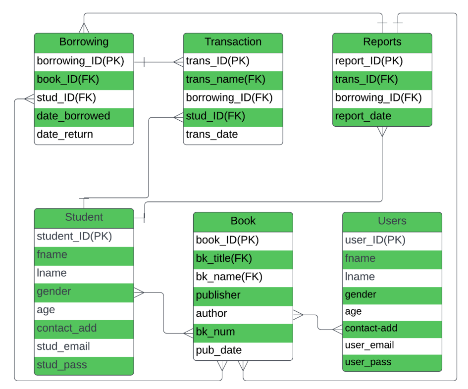

# Library Management System :book:
This repository contains the database design for a Library Management System. The aim of this project is to simplify the tasks of managing books and user accounts in a library. 

## Content

The repository is composed of several important files and directories:

1. **ER Diagram (Image)** - An image file showing the Entity Relationship (ER) diagram for the Library Management System.
2. **Implementation Report (PDF)** - A detailed report in PDF format, describing the implementation of the database, its tables, relationships, and the decisions taken during design.
3. **Relational Model (SQL)** - The SQL file contains the scripts used to create the tables in the database along with their constraints, indices, etc. 
4. **SQL Query (SQL)** - This SQL file contains various queries used to manipulate and retrieve data from the database. This can serve as a reference for understanding how to interact with the database.
5. **Images (Folder)** - This folder contains any relevant images related to this project, such as conceptual design images, screenshots of results, etc.

## Usage

To get started with the project, you can clone this repository locally and then run the SQL scripts provided in your preferred SQL database system. You can use the ER diagram and the Implementation report as guides for understanding the database design and architecture.

## Contributions

Feel free to contribute to this project! If you find any bugs or issues, please open an issue. If you want to improve some parts of the code, make a pull request.
